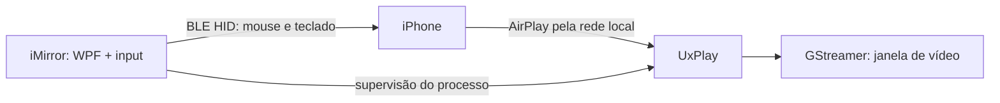

# iMirror

Espelhe e controle seu iPhone diretamente pelo Windows.


O iMirror combina **AirPlay/UxPlay** para receber vídeo, **GStreamer** para exibi-lo em uma janela externa e **Bluetooth LE HID** para enviar mouse e teclado. A interface usa WPF/.NET. O receiver atual oferece H.264/H.265; o perfil `UxPlay-iOS27` habilita `-h265`.

O projeto não usa jailbreak nem o protocolo privado de iPhone Mirroring da Apple. Não promete equivalência ao recurso oficial do macOS.

## Estado do projeto

Validação física informada pelo usuário: **iPhone 14, iOS 27.0.1**, Windows 10 x64 build 19045, adaptador Realtek com BLE Peripheral Role.

| Área | Estado |
| --- | --- |
| AirPlay | Conexão e vídeo na janela externa confirmados |
| Transporte BLE/HOGP | **PHYSICALLY VALIDATED**: pairing e subscribers de mouse/teclado |
| Input | **PHYSICALLY VALIDATED**: cursor AssistiveTouch, movimento, clique e letras básicas; simultâneo ao AirPlay |
| UX atualizada | **PENDING USER VALIDATION**: cursor local oculto, velocidade, símbolos e acentos ABNT2 |
| Wheel, rotação e reconexão | Implementados ou previstos nos roteiros; confirmação física específica ainda pendente |

Windows 11 e outros adaptadores/iPhones precisam de validação própria. Testes locais não substituem o teste físico.

## Funcionalidades

- Recepção AirPlay com anúncio Bonjour/mDNS e vídeo externo do GStreamer.
- Geometria de portrait/landscape com aspect ratio, letterboxing e DPI físico.
- Pareamento BLE, identificação de subscribers HID e monitoramento do link.
- Mouse relativo, clique, wheel e teclado HID.
- Captura temporária somente sobre o vídeo do receiver pertencente à sessão, em foreground.
- Cursor local oculto durante a captura no viewport; velocidade linear de **0,25x a 3x**, padrão **1x**.
- Layout **Auto**, **Português Brasil ABNT2** ou **US**, usando usages físicos e teclas mortas.
- **ESC / Ctrl+Alt+Q** para interromper; releases em parada, saída do viewport, perda de foco ou conexão.
- Logs de diagnóstico, fila limitada e pacing/coalescing de movimento.

Ponteiro absoluto/digitizer está **desabilitado**. Layouts além de US/PT-BR e reconexão automática não têm suporte garantido.

## Como funciona



**Vídeo:** Bonjour anuncia o receiver; UxPlay negocia AirPlay e entrega vídeo ao GStreamer. O áudio está desativado no perfil atual.

**Controle:** o Windows publica um serviço HOGP composto. Após pairing/subscriptions, o iMirror envia teclas e deltas relativos ao host selecionado. AirPlay e BLE são canais separados.

## Requisitos

### Para usuários

- Windows x64 com APIs de Windows 10 2004/build **19041+** e runtime .NET Desktop 10 compatível com a [matriz oficial de sistemas](https://learn.microsoft.com/en-us/dotnet/core/install/windows).
- Adaptador e driver Bluetooth LE com **Peripheral Role** e Bluetooth ligado. BLE central apenas não é suficiente; o app verifica a capacidade real.
- iPhone com AirPlay; notebook e iPhone na mesma rede local para vídeo.
- AssistiveTouch ligado para visualizar o ponteiro no iPhone.
- UxPlay **1.73.7**, GStreamer x64 **1.28.7** e Bonjour instalados/configurados conforme o diagnóstico do projeto.

### Para desenvolvimento

- Git e [SDK .NET 10](https://dotnet.microsoft.com/download/dotnet/10.0) no Windows.
- O restore obtém `Microsoft.Windows.SDK.NET.Ref` da fonte oficial definida em `NuGet.Config`.
- MSYS2 **UCRT64** para preparar UxPlay/GStreamer. Não misture DLLs x86, MSVC e MinGW.

## Instalação e execução

Não há instalador de release pronto neste repositório. Os binários nativos, `.tools`, caches e artefatos de build **não são versionados**.

```powershell
git clone https://github.com/crdso/imirror.git
cd imirror
dotnet restore iMirror.sln --configfile NuGet.Config
.\tools\build.ps1 -Configuration Release
```

Prepare as dependências conforme [dependências nativas](docs/NATIVE_DEPENDENCIES.md). Em uma instalação nova, o script administrativo verifica Bonjour/firewall; não o execute novamente em uma instalação funcional sem necessidade.

Depois do build e da preparação:

```powershell
.\tools\start-imirror.ps1 -AirPlayProfile UxPlay-iOS27
```

Esse launcher usa Release, seleciona o perfil existente e evita instâncias duplicadas. `tools/run.ps1` também compila/executa, mas seleciona o `airplay.json` base. O executável gerado fica em `src/iMirror.App/bin/Release/net10.0-windows/`; o launcher também funciona com o SDK local em `.tools/dotnet`.

## Como usar

1. Abra iMirror e clique **Iniciar AirPlay**.
2. No iPhone: **Central de Controle > Espelhamento de Tela > iMirror - Windows**.
3. Aguarde a imagem na janela externa do GStreamer.
4. Clique **Conectar controle Bluetooth**.
5. No iPhone: **Ajustes > Bluetooth > nome deste PC**; confirme o pareamento quando solicitado. O nome Bluetooth é o nome do PC, não o receiver AirPlay.
6. Aguarde **Mouse: conectado** e **Keyboard: conectado**. Bond ou advertising sozinhos não confirmam HID ativo.
7. Configure AssistiveTouch e o layout descritos abaixo.
8. Escolha a velocidade e clique **Ativar controle**. Use o mouse e teclado dentro do vídeo em foco.
9. **ESC ou Ctrl+Alt+Q** devolvem o input ao Windows. Perder foco também encerra a captura; reative explicitamente quando quiser voltar.

Ao sair para uma barra do vídeo ou outra janela, o cursor local reaparece, a fila é descartada e os releases são enviados. Retornar ao viewport permite capturar novamente enquanto a sessão continua ativa.

## AssistiveTouch e teclado virtual

Para o ponteiro: **Ajustes > Acessibilidade > Toque > AssistiveTouch = ON**.

Para continuar usando o teclado do próprio iPhone, ative **Mostrar Teclado na Tela** no AssistiveTouch. É recomendado, não um requisito do BLE. [Instruções da Apple](https://support.apple.com/guide/iphone/use-assistivetouch-iph96b21954/ios).

Deixe **Controle de Permanência / Dwell Control** e **Teclas do Mouse OFF**. Não é necessário ativar **Adaptações de Toque**.

O Report Map não inclui Consumer Control/Eject: não foi comprovada uma função confiável de exibir o teclado no iOS por esse report. A opção do AssistiveTouch é o caminho documentado.

## Teclado US e PT-BR/ABNT2

Selecione **PortugueseBrazilAbnt2** para Português Brasil ABNT2 ou **UnitedStates** para US. **Auto** lê o HKL da janela de vídeo: identifica Português Brasil; outros layouts usam fallback US. Não interpreta layouts arbitrários.

Configure **o mesmo layout no Windows e no iPhone**, em **Ajustes > Geral > Teclado > Teclado Físico**. O iOS interpreta usages físicos; o iMirror não envia texto Unicode artificial.

A captura usa scan codes para as teclas OEM, incluindo a posição de aspas, ç, acentos e as teclas extras ABNT2. Teclas mortas são encaminhadas como press/release; a composição ocorre no iPhone. Os testes locais cobrem os símbolos solicitados e `á à â ã é ê í ó ô õ ú ç`, mas o resultado no layout iOS ainda precisa de confirmação.

O intervalo de usages do teclado foi ampliado até **International1 (0x87)** para a tecla ABNT2 `/ ?`. IDs e tamanhos dos reports, mouse e pairing permanecem iguais. Se o iPhone reutilizar um Report Map antigo e somente essa tecla falhar, pode ser necessário esquecer/reparear o PC; não faça isso preventivamente.

## Limitações

- O mouse é **relativo**: a posição do Windows não corresponde necessariamente ao cursor do iPhone. O iOS aplica sua própria aceleração/sensibilidade; não há promessa de clique absoluto no ponto do vídeo.
- Ocultar o cursor local não impede que ele alcance a borda do viewport; não há confinamento ou recentralização automática.
- O cursor AssistiveTouch continua visível no stream. A superfície de captura Win32 fica acima do viewport apenas enquanto autorizado, sem embutir vídeo no WPF.
- Reconexão BLE pode exigir **Ajustes > Bluetooth**. A captura nunca reativa sozinha.
- Boot mouse não tem wheel. O wheel em Report Mode ainda precisa de confirmação física específica.
- Appearance alternativo é experimental; neste PC o Windows rejeitou o anúncio adicional. O HOGP normal permanece como padrão.
- Sem link ativo, não é possível comprovar entrega de releases ao iPhone. O transporte mantém sincronização neutra pendente para o próximo link.

## Arquitetura do projeto

```text
src/
  iMirror.App/          Interface WPF e supervisão da sessão
  iMirror.AirPlay/      Configuração, diagnóstico e processo UxPlay
  iMirror.Bluetooth/    Serviço HOGP, subscriptions e reports
  iMirror.Input/        Captura do viewport, cursor e mapeamento físico
  iMirror.Core/         Diagnóstico e contratos comuns
tests/                 Suites executáveis das Fases 1, 2 e 3
experiments/BleHidProbe/ Probe manual isolado, sem hooks globais
tools/                 Build, testes, preparação e diagnóstico
docs/                  Uso, arquitetura e registros de validação
third_party/           Fontes, patch externo e avisos de terceiros
```

## Desenvolvimento

Feche o iMirror antes de recompilar. Execute na raiz:

```powershell
dotnet restore iMirror.sln --configfile NuGet.Config
.\tools\build.ps1 -Configuration Debug
.\tools\build.ps1 -Configuration Release
.\tools\test.ps1 -Configuration Debug
.\tools\test.ps1 -Configuration Release
.\tools\start-ble-hid-probe.ps1 -Build -SelfTest
```

`test.ps1` executa todas as suites da solução, incluindo verificações WPF, lifecycle AirPlay e input/HID; não se resume a `dotnet test`. O probe tem testes próprios e deve estar fechado antes do BLE no iMirror.

`tools/airplay-doctor.ps1` verifica a instalação local. Feche o receiver antes de executar. Um resultado pronto comprova preparação local, não compatibilidade física universal.

Consulte [controle BLE e roteiro da UX](docs/PHASE3_CONTROL.md), [probe isolado](docs/PHASE3A_PROBE.md) e [dependências/patch externo](third_party/README.md). Os demais documentos de fases anteriores são registros históricos.

## Segurança e privacidade

O controle exige pairing explícito, criptografia e subscriber do host selecionado. Os hooks existem apenas na sessão de controle e devolvem input ao Windows ao perder foco/link. O sender aguarda o envio pendente antes de finalizar releases e registrar a parada.

Texto digitado e movimentos individuais não são registrados no log normal. O app não armazena credenciais. Logs locais e arquivos de testes físicos são ignorados pelo Git; revise e sanitize qualquer diagnóstico antes de compartilhar.

## Capturas de tela

<!-- Adicione aqui capturas sanitizadas do AirPlay e do controle BLE. -->

## Créditos e licença

- [UxPlay](https://github.com/FDH2/UxPlay): receiver AirPlay externo.
- [GStreamer](https://gstreamer.freedesktop.org/): pipeline e janela de vídeo.
- [windows-ble-hid](https://github.com/abhishek-raj/windows-ble-hid): referência HOGP e descriptor adaptado, com avisos MIT preservados.
- [Microsoft BluetoothLEExplorer / VirtualKeyboard](https://github.com/microsoft/BluetoothLEExplorer/blob/master/BluetoothLEExplorer/BluetoothLEExplorer/Models/VirtualKeyboard.cs): referência técnica comparada.

O projeto ainda não possui licença própria definida. Os componentes externos mantêm suas licenças; consulte [avisos BLE](src/iMirror.Bluetooth/THIRD_PARTY_NOTICES.md) e [third_party](third_party/README.md).
